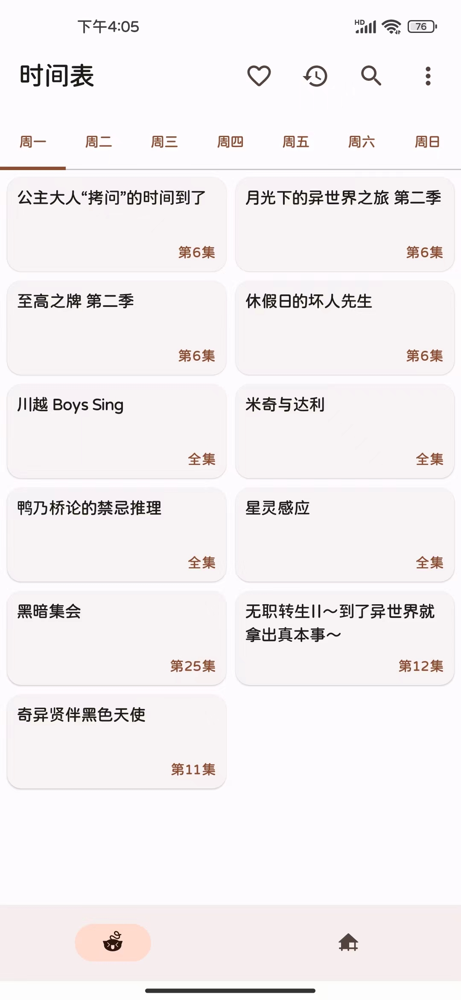
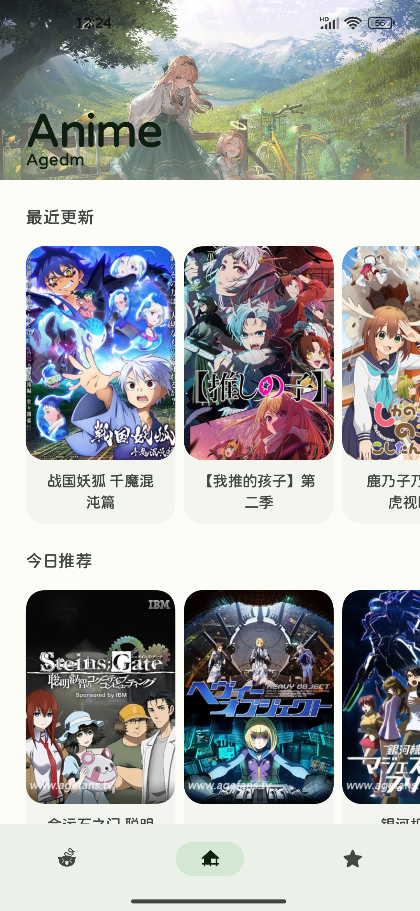
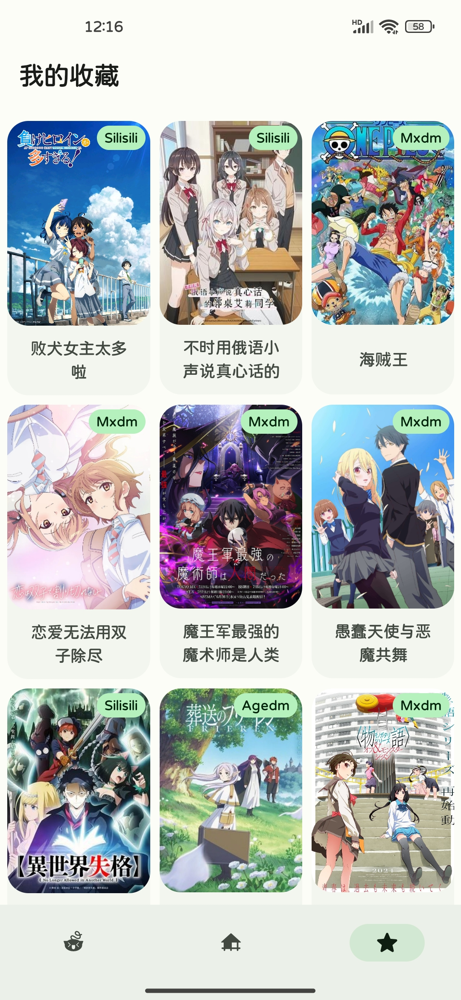
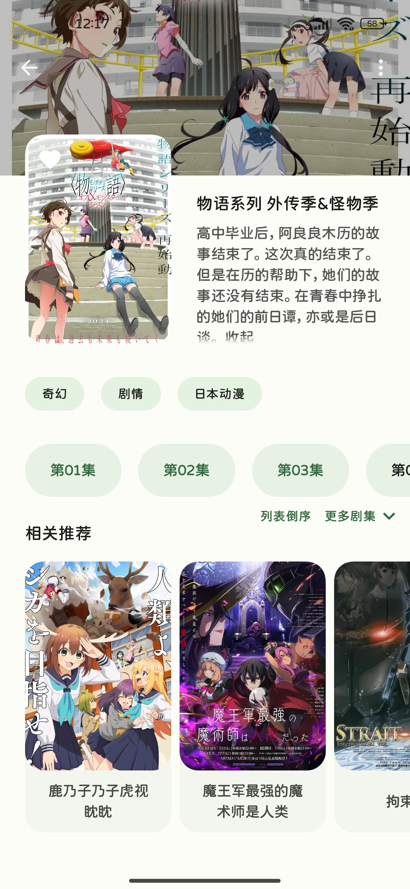
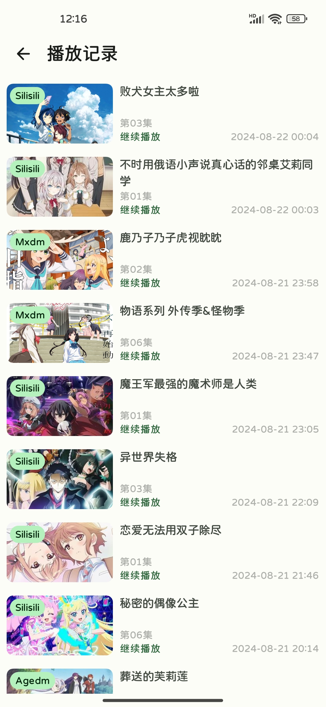
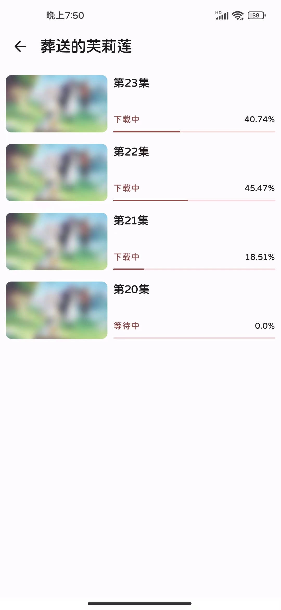
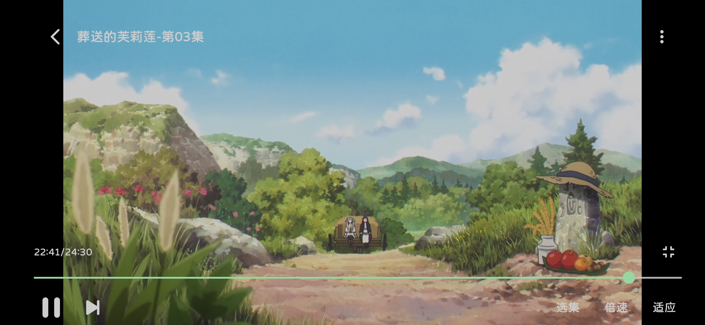

# Anime

一个简洁的播放动漫的App，支持下载，弹幕，多数据源等功能，使用[Jetpack Compose](https://developer.android.com/jetpack?hl=zh-cn)
进行开发

## 如何下载安装

点击此链接[下载地址](https://github.com/Lanlinju/Anime/releases/latest)
前往下载页面，然后选择下载以`.apk`结尾的文件，Android
TV或者系统版本低于安卓8.0的，请点击查看[这里](https://github.com/lanlinju/Anime/releases/tag/v1.2.1)

## 应用截图

<table>
  <tr>
    <td></td>
    <td></td>
    <td></td>
  <tr>
  <tr>
    <td></td>
    <td></td>
    <td></td>
  </tr>
  <tr>
    <td colspan="3"></td>
  </tr>
</table>

## 相关功能

- [x] 首页推荐
- [x] 番剧搜索
- [x] 番剧时间表
- [x] 多数据源支持
- [x] 历史记录
- [x] 番剧下载
- [x] 番剧收藏
- [x] 动态主题颜色
- [x] 视频播放器
- [x] 倍速播放
- [x] 外部播放器播放
- [ ] 选择下载目录
- [x] 弹幕功能
- [ ] BT资源下载

## Architecture

使用的是[Google应用架构指南](https://developer.android.com/topic/architecture), MVVM 和 Clean
Architecture

## 参考来源

视频弹幕源来自于[弹弹play](https://www.dandanplay.com)开放API

- [SakuraAnime](https://github.com/670848654/SakuraAnime)：樱花动漫网站数据解析参考实现来源
- [Animite](https://github.com/imashnake0/Animite)：应用UI设计参考实现来源
- [compose-video-player](https://github.com/imherrera/compose-video-player)：Exoplayer视频播放器封装参考实现来源
- [FreeToPlay](https://github.com/qababadr/FreeToPlay)：应用MVVM架构参考实现来源
- [DownloadX](https://github.com/ssseasonnn/DownloadX)：视频文件下载功能参考实现来源
- [Ani](https://github.com/open-ani/ani)：视频弹幕功能参考实现来源