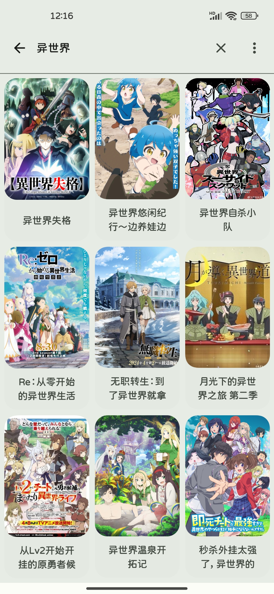
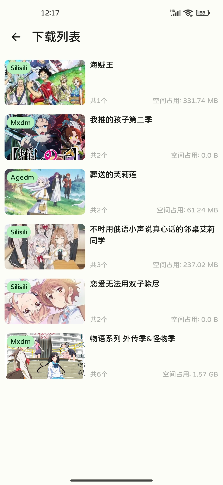

# Anime
基于樱花动漫网站数据的一个简洁的播放动漫的App，使用[Jetpack Compose](https://developer.android.com/jetpack?hl=zh-cn)进行开发

## 如何下载安装
点击此链接[下载地址](https://github.com/Lanlinju/Anime/releases/latest)前往下载页面，然后选择下载以`.apk`结尾的文件

## 应用截图

  
  
  
  
  
  
  
  
  

## 参考开源
- [SakuraAnime](https://github.com/670848654/SakuraAnime)：樱花动漫网站数据解析参考实现来源
- [Animite](https://github.com/imashnake0/Animite)：应用UI设计参考实现来源
- [compose-video-player](https://github.com/imherrera/compose-video-player)：Exoplayer视频播放器封装参考实现来源
- [FreeToPlay](https://github.com/qababadr/FreeToPlay)：应用MVVM架构参考实现来源
- [DownloadX](https://github.com/ssseasonnn/DownloadX)：视频文件下载功能参考实现来源